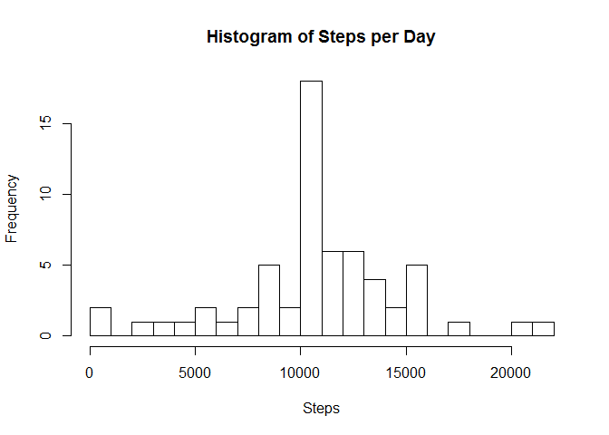
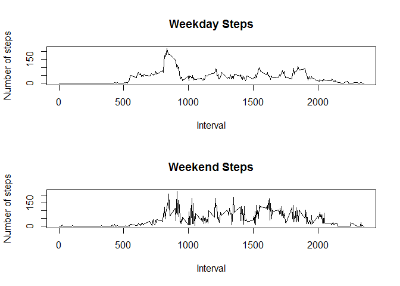

# Reproducible Research: Peer Assessment 1
<!--
# setwd("Z:/docs/work/datasci/5reproducible-research/RepData_PeerAssessment1")
# library(knitr)
# knit2html("PA1_template.Rmd")
-->


## Loading and preprocessing the data

```r
if (!file.exists("activity.csv")) {# check if exists
  unzip("activity.zip")
}
activity<-read.csv("activity.csv",colClasses=c("integer","Date","integer"))
```

## What is the mean total number of steps taken per day?
**1. Calculate the total number of steps taken per day**

```r
library(dplyr)
```

```
## 
## Attaching package: 'dplyr'
## 
## The following objects are masked from 'package:stats':
## 
##     filter, lag
## 
## The following objects are masked from 'package:base':
## 
##     intersect, setdiff, setequal, union
```

```r
steps_per_day <- activity %>% filter(!is.na(steps)) %>% group_by(date) %>% summarize(steps = sum(steps))
```

**2. Historgram of Steps Per day**

```r
hist(steps_per_day$steps, breaks=30, xlab="Steps", main="Histogram of Steps per Day")
```

 

**3. Calculate and report the mean and median of the total number of steps taken per day**

```r
mean(steps_per_day$steps)# no NAs so no need to remove
```

```
## [1] 10766.19
```

```r
median(steps_per_day$steps)
```

```
## [1] 10765
```


## What is the average daily activity pattern?

**1. Plot of Average Daily Activity Pattern**

```r
average_steps<-function(activity){# defined so we can use later
  activity %>% filter(!is.na(steps)) %>% group_by(interval) %>% summarize(steps = mean(steps))
}
average_fivemin_steps<-average_steps(activity)
plot(average_fivemin_steps, type="l", ylab="Steps", xlab="Interval", main="Plot of Average Daily Activity Pattern")
```

 

**2. 5-minute Interval with Most Number of Steps on average**

```r
max_interval<-average_fivemin_steps[which.max(average_fivemin_steps$steps),]
max_interval$interval
```

```
## [1] 835
```

## Inputing missing values
**1. Total number of missing values:**

```r
sum(is.na(activity$steps))
```

```
## [1] 2304
```


**2. Fill NA's by the mean for that 5 minute interval day (this is lazy but will do for this exercise):**


```r
set_step<-function(row){
  step<-row$steps
  if(is.na(step)){
    # set step to mean for the day
    step<-average_fivemin_steps[average_fivemin_steps$interval==row$interval,]$steps
  }
  step
}
new_steps<-numeric()
for(i in 1:nrow(activity)){
  new_steps<-c(new_steps,set_step(activity[i,]))
}
```

**3. Create a new dataset that is equal to the original dataset but with the missing data filled in.**


```r
length(new_steps)
```

```
## [1] 17568
```

```r
nrow(activity)# 4 missing
```

```
## [1] 17568
```

```r
activity$steps<-new_steps
```

**4. Make a histogram of the total number of steps taken each day and Calculate and report the mean and median total number of steps**

```r
# recalculate steps per day
steps_per_day <- activity %>% filter(!is.na(steps)) %>% group_by(date) %>% summarize(steps = sum(steps))
hist(steps_per_day$steps, breaks=30, xlab="Steps", main="Histogram of Steps per Day")
```

 

```r
mean(steps_per_day$steps)
```

```
## [1] 10766.19
```

```r
median(steps_per_day$steps)
```

```
## [1] 10766.19
```

The mean differs, as it is larger and now the same as the median(the mean is no longer skewed).


## Are there differences in activity patterns between weekdays and weekends?

```r
activity <- mutate(activity, day=factor(weekdays(activity$date)))
activity_weekend_index<-activity$day==c("Saturday","Sunday")
weekend_steps<-average_steps(activity[activity_weekend_index,])
weekday_steps<-average_steps(activity[!activity_weekend_index,])

par(mfrow=c(2,1))# bit rough should do this in ggplot
plot(weekday_steps, type="l", ylab="Number of steps", xlab="Interval", main="Weekday Steps")
plot(weekend_steps, type="l", ylab="Number of steps", xlab="Interval", main="Weekend Steps")
```

 

```r
par(mfrow=c(1,1))
```
